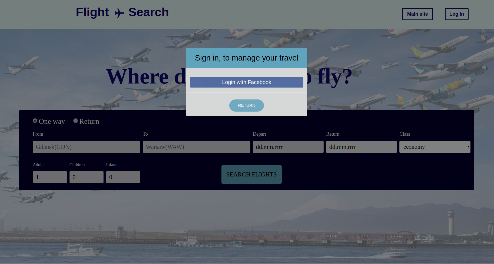

# Flight search
> The application has been designed as flight search.

## Table of contents
* [General info](#general-info)
* [Features](#features)
* [Technologies](#technologies)
* [Status](#status)
* [Inspiration](#inspiration)

## General info
>The main feature of the application is flight search system. Not authenticated users has the ability to search one way or multiple flights between two cities, filter them and sign in with facebook by oAuth2. 
Logged users can add single flights to their favourite flights, which causes that they will get email with changing price of flight every day.

## Features

### Home search page
 
>  Home page where the user completes the form with the details of his journey. 
>Users should provide origin place, destination place, outbound date, class of transport and the number of adults, children and babies. 
>Optionally, the user can indicate that he wants to search for a return flight and provide a return date.

 
>When the user types origin place and destination place, uses live search, which starts after entering at least two characters in a given text field 

### List of itineraries
> After complete the form, when user click search flight, he receives a list of all available connections. 
>The list contains specific flights, where the user sees the basic details of the flight, including the name of the carrier, 
>departure and arrival times, length of the flight, information whether the flight has a change and the best price available to buy the ticket.

 

 

### Sorting and filtering

>Moreover, users can sort and filter search results. You can filter the results for the number of transfers, departure time and flight duration. 
>By default, search results are sorted by departure time. 
>The user can change the sorting type to sort by trip length and sort by the cheapest prices.

 

 

 

### Details view

>Users can also check a details of flights when he click on "Select" button. 
in this view, in addition to all flight information, the user gets a list of agents and the prices they offer. 
>After clicking on a specific agent, the user is automatically redirected to the agent's website, where he can buy a ticket for a particular flight.

 

### Oauth2

> The user can log in to the application via oatuh facebook.
> After logging in, the user gets the opportunity to use the functionality to manage favorite flights. 

 

### List of itineraries after login

>  After logging in, when the user searches for a list of available flights on a given route, he is able to add and remove them from his favorite flights.

 

 

### Favourite flights 

>  After adding specific flights to your favorite flights, the user has the option of entering the view with a list of flight data along with all flight information

 

### Sending email service 

>  When the user already has a list of his or her favorite flights, the application automatically sends the user an email once a day with the current cheapest ticket purchase option. 
In addition, the user is shown a direct link to the agent, where he can buy the ticket. 

 
 

## Technologies
* Java SE 12
* Spring boot
* Hibernate ORM 5.4.2
* REST API
* Docker
* Tomcat
* Maven 3.3.9
* Freemarker 2.3.29
* Bootstrap 4.3.1
* HTML5, CSS3, JS
* jQuery, AJAX

## Status
Project is: _in the process of making_.

## Inspiration
Own idea.